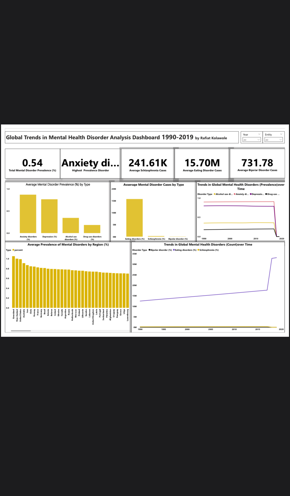

# Global Mental Health Analysis (1990–2019)

## Project Overview
Using data from 1990–2019, this analysis explores patterns and trends across major mental health disorders worldwide. The dashboard focuses on **prevalence, case counts, disorder types, and regional differences**, providing insights into the global mental health burden.

## Tools Used
- Power BI
- Data Cleaning & Preparation
- Data Modeling
- Data Visualization
- Trend Analysis

## Objectives
- Examine trends in global mental health prevalence and case counts  
- Identify the most common mental health disorders worldwide  
- Analyze variations in disorder types across regions  
- Assess long-term trends from 1990 to 2019  
- Highlight key insights to support awareness, planning, and resource allocation

## Key Insights
- Anxiety disorders consistently emerge as the most prevalent mental health condition globally  
- The overall number of mental health cases has increased steadily over time, reflecting population growth, lifestyle changes, and improved diagnosis  
- Conditions like eating disorders affect millions, while others such as schizophrenia and bipolar disorder, though less common, carry significant long-term impact  
- Regional variations highlight differences in awareness, healthcare access, and reporting

## Conclusion
This analysis demonstrates how examining both prevalence and case counts can provide a comprehensive understanding of the global mental health burden. Insights from this dashboard can support **better planning, awareness campaigns, and resource allocation** to address mental health challenges worldwide.

## Dashboard Preview

